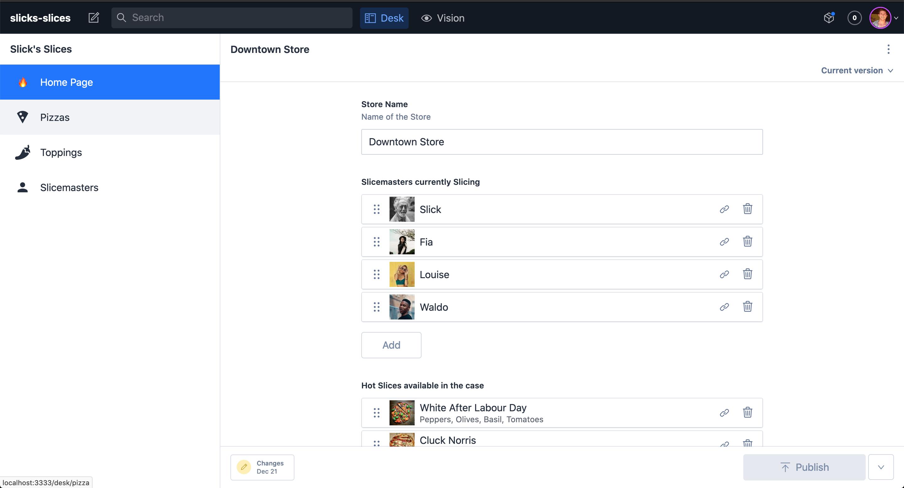
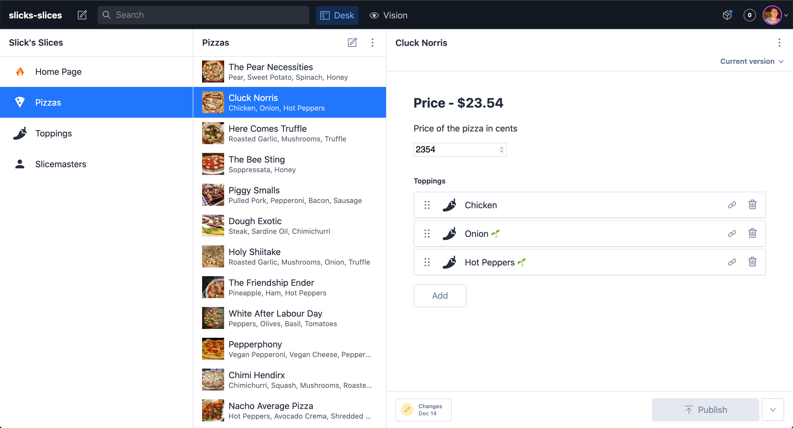
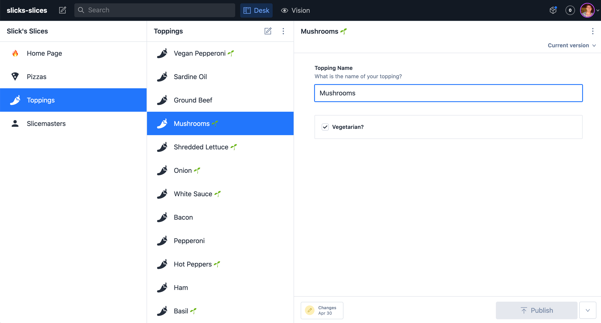
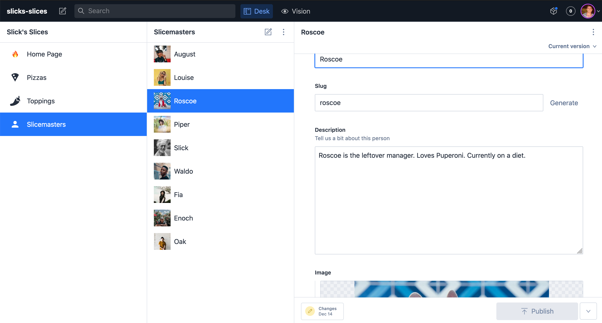

# Slick's Slices GatsbyJS

Live deployment: https://slicks-slices-gskll.netlify.app/

- Jamstack: Gastby, GraphQL, React and backed by Sanity headless CMS
- Static pages except for Home/Order pages. 
- Pages generated statically and dynamically from Gatsby templates with GraphQL
- Pizza ordering is done by serverless function which sends an order details via email
- Pages SEO optimized with React-Helmet package
- Auto deployment on Netlify

Site made as part of WesBos` MasterGatsby course

## Backend/CMS Screenshots

